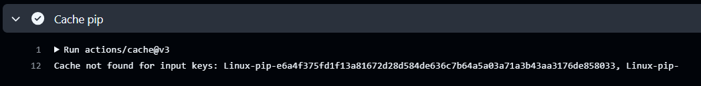
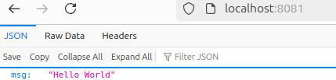

# keepcoding-devops-liberando-productos-practica-final

## Contenido

- [Objetivo](#objetivo)
- [Proyecto inicial](#proyecto-inicial)
- [Software necesario](#software-necesario)
- [Ejecución de servidor](#ejecucion-de-servidor)
  - [Ejecución directa con Python](#ejecucion-directa-con-python)
  - [Ejecución a través de un contenedor Docker](#ejecución-a-traves-de-un-contenedor-docker)
- [Comprobación de endpoints de servidor y métricas](#comprobacion-de-endpoints-de-servidor-y-metricas)
- [Tests](#tests)
- [Practica a realizar](#practica-a-realizar)
- [Entregables](#entregables)
  - [Estructura del proyecto](#estructura-del-proyecto)
  - [Ficheros CI/CD](#ficheros-cicd)
  - [Charts de Helm](#charts-de-helm)
  - [Configuracion de alertas](#configuración-de-alertas)
  - [Despliegue de la aplicacion web Prometheus y Grafana](#despliegue-de-la-aplicación-web-prometheus-y-grafana)
  - [Pruebas de la aplicacion web](#pruebas-de-la-aplicación-web)
  - [Pruebas de estres](#pruebas-de-estrés)
  - [Mejoras futuras](#mejoras-futuras)

## Objetivo

El objetivo es mejorar un proyecto creado previamente para ponerlo en producción, a través de la adicción de una serie de mejoras.

## Proyecto inicial

El proyecto inicial es un servidor que realiza lo siguiente:

- Utiliza [FastAPI](https://fastapi.tiangolo.com/) para levantar un servidor en el puerto `8081` e implementa inicialmente dos endpoints:
  - `/`: Devuelve en formato `JSON` como respuesta `{"health": "ok"}` y un status code 200.
  - `/health`: Devuelve en formato `JSON` como respuesta `{"message":"Hello World"}` y un status code 200.

- Se han implementado tests unitarios para el servidor [FastAPI](https://fastapi.tiangolo.com/)

- Utiliza [prometheus-client](https://github.com/prometheus/client_python) para arrancar un servidor de métricas en el puerto `8000` y poder registrar métricas, siendo inicialmente las siguientes:
  - `Counter('server_requests_total', 'Total number of requests to this webserver')`: Contador que se incrementará cada vez que se haga una llamada a alguno de los endpoints implementados por el servidor (inicialmente `/` y `/health`)
  - `Counter('healthcheck_requests_total', 'Total number of requests to healthcheck')`: Contador que se incrementará cada vez que se haga una llamada al endpoint `/health`.
  - `Counter('main_requests_total', 'Total number of requests to main endpoint')`: Contador que se incrementará cada vez que se haga una llamada al endpoint `/`.

## Software necesario

Es necesario disponer del siguiente software:

- `Python` en versión `3.11.8` o superior, disponible para los diferentes sistemas operativos en la [página oficial de descargas](https://www.python.org/downloads/release/python-3118/)

- `virtualenv` para poder instalar las librerías necesarias de Python, se puede instalar a través del siguiente comando:

    ```sh
    pip3 install virtualenv
    ```

    En caso de estar utilizando Linux y el comando anterior diera fallos se debe ejecutar el siguiente comando:

    ```sh
    sudo apt-get update && sudo apt-get install -y python3.11-venv
    ```

- `Docker` para poder arrancar el servidor implementado a través de un contenedor Docker, es posible descargarlo a [través de su página oficial](https://docs.docker.com/get-docker/).

## Ejecución de servidor

### Ejecución directa con Python

1. Instalación de un virtualenv, **realizarlo sólo en caso de no haberlo realizado previamente**:
   1. Obtener la versión actual de Python instalada para crear posteriormente un virtualenv:

        ```sh
        python3 --version
        ```

        El comando anterior mostrará algo como lo mostrado a continuación:ç

        ```sh
        Python 3.11.8
        ```

   2. Crear de virtualenv en la raíz del directorio para poder instalar las librerías necesarias:

      ```sh
      python3 -m venv venv
      ```

2. Activar el virtualenv creado en el directorio `venv` en el paso anterior:

     ```sh
     source venv/bin/activate
     ```

3. Instalar las librerías necesarias de Python, recogidas en el fichero `requirements.txt`, **sólo en caso de no haber realizado este paso previamente**. Es posible instalarlas a través del siguiente comando:

    ```sh
    pip3 install -r requirements.txt
    ```

4. Ejecución del código para arrancar el servidor:

    ```sh
    python3 src/app.py
    ```

5. La ejecución del comando anterior debería mostrar algo como lo siguiente:

    ```sh
    [2022-04-16 09:44:22 +0000] [1] [INFO] Running on http://0.0.0.0:8081 (CTRL + C to quit)
    ```

### Ejecución a través de un contenedor Docker

1. Crear una imagen Docker con el código necesario para arrancar el servidor:

    ```sh
    docker build -t simple-server:0.0.1 .
    ```

2. Arrancar la imagen construida en el paso anterior mapeando los puertos utilizados por el servidor de FastAPI y el cliente de prometheus:

    ```sh
    docker run -d -p 8000:8000 -p 8081:8081 --name simple-server simple-server:0.0.1
    ```

3. Obtener los logs del contenedor creado en el paso anterior:

    ```sh
    docker logs -f simple-server
    ```

4. La ejecución del comando anterior debería mostrar algo como lo siguiente:

    ```sh
    [2022-04-16 09:44:22 +0000] [1] [INFO] Running on http://0.0.0.0:8081 (CTRL + C to quit)
    ```

## Comprobación de endpoints de servidor y métricas

Una vez arrancado el servidor, utilizando cualquier de las formas expuestas en los apartados anteriores, es posible probar las funcionalidades implementadas por el servidor:

- Comprobación de servidor FastAPI, a través de llamadas a los diferentes endpoints:

  - Realizar una petición al endpoint `/`

      ```sh
      curl -X 'GET' \
      'http://0.0.0.0:8081/' \
      -H 'accept: application/json'
      ```

      Debería devolver la siguiente respuesta:

      ```json
      {"message":"Hello World"}
      ```

  - Realizar una petición al endpoint `/health`

      ```sh
      curl -X 'GET' \
      'http://0.0.0.0:8081/health' \
      -H 'accept: application/json' -v
      ```

      Debería devolver la siguiente respuesta.

      ```json
      {"health": "ok"}
      ```

- Comprobación de registro de métricas, si se accede a la URL `http://0.0.0.0:8000` se podrán ver todas las métricas con los valores actuales en ese momento:

  - Realizar varias llamadas al endpoint `/` y ver como el contador utilizado para registrar las llamadas a ese endpoint, `main_requests_total` ha aumentado, se debería ver algo como lo mostrado a continuación:

    ```sh
    # TYPE main_requests_total counter
    main_requests_total 4.0
    ```

  - Realizar varias llamadas al endpoint `/health` y ver como el contador utilizado para registrar las llamadas a ese endpoint, `healthcheck_requests_total` ha aumentado, se debería ver algo como lo mostrado a continuación:

    ```sh
    # TYPE healthcheck_requests_total counter
    healthcheck_requests_total 26.0
    ```

  - También se ha credo un contador para el número total de llamadas al servidor `server_requests_total`, por lo que este valor debería ser la suma de los dos anteriores, tal y como se puede ver a continuación:

    ```sh
    # TYPE server_requests_total counter
    server_requests_total 30.0
    ```

## Tests

Se ha implementado tests unitarios para probar el servidor FastAPI, estos están disponibles en el archivo `src/tests/app_test.py`.

Es posible ejecutar los tests de diferentes formas:

- Ejecución de todos los tests:

    ```sh
    pytest
    ```

- Ejecución de todos los tests y mostrar cobertura:

    ```sh
    pytest --cov
    ```

- Ejecución de todos los tests y generación de report de cobertura:

    ```sh
    pytest --cov --cov-report=html
    ```

## Practica a realizar

A partir del ejemplo inicial descrito en los apartados anteriores es necesario realizar una serie de mejoras:

Los requirimientos son los siguientes:

- Añadir por lo menos un nuevo endpoint a los existentes `/` y `/health`, un ejemplo sería `/bye` que devolvería `{"msg": "Bye Bye"}`, para ello será necesario añadirlo en el fichero [src/application/app.py](./src/application/app.py)

- Creación de tests unitarios para el nuevo endpoint añadido, para ello será necesario modificar el [fichero de tests](./src/tests/app_test.py)

- Opcionalmente creación de helm chart para desplegar la aplicación en Kubernetes, se dispone de un ejemplo de ello en el laboratorio realizado en la clase 3

- Creación de pipelines de CI/CD en cualquier plataforma (Github Actions, Jenkins, etc) que cuenten por lo menos con las siguientes fases:

  - Testing: tests unitarios con cobertura. Se dispone de un [ejemplo con Github Actions en el repositorio actual](./.github/workflows/test.yaml)

  - Build & Push: creación de imagen docker y push de la misma a cualquier registry válido que utilice alguna estrategia de release para los tags de las vistas en clase, se recomienda GHCR ya incluido en los repositorios de Github. Se dispone de un [ejemplo con Github Actions en el repositorio actual](./.github/workflows/release.yaml)

- Configuración de monitorización y alertas:

  - Configurar monitorización mediante prometheus en los nuevos endpoints añadidos, por lo menos con la siguiente configuración:
    - Contador cada vez que se pasa por el/los nuevo/s endpoint/s, tal y como se ha realizado para los endpoints implementados inicialmente

  - Desplegar prometheus a través de Kubernetes mediante minikube y configurar alert-manager para por lo menos las siguientes alarmas, tal y como se ha realizado en el laboratorio del día 3 mediante el chart `kube-prometheus-stack`:
    - Uso de CPU de un contenedor mayor al del límite configurado, se puede utilizar como base el ejemplo utilizado en el laboratorio 3 para mandar alarmas cuando el contenedor de la aplicación `fast-api` consumía más del asignado mediante request

  - Las alarmas configuradas deberán tener severity high o critical

  - Crear canal en slack `<nombreAlumno>-prometheus-alarms` y configurar webhook entrante para envío de alertas con alert manager

  - Alert manager estará configurado para lo siguiente:
    - Mandar un mensaje a Slack en el canal configurado en el paso anterior con las alertas con label "severity" y "critical"
    - Deberán enviarse tanto alarmas como recuperación de las mismas
    - Habrá una plantilla configurada para el envío de alarmas

    Para poder comprobar si esta parte funciona se recomienda realizar una prueba de estres, como la realizada en el laboratorio 3 a partir del paso 8.

  - Creación de un dashboard de Grafana, con por lo menos lo siguiente:
    - Número de llamadas a los endpoints
    - Número de veces que la aplicación ha arrancado

## Entregables

Se deberá entregar mediante un repositorio realizado a partir del original lo siguiente:

- Código de la aplicación y los tests modificados
- Ficheros para CI/CD configurados y ejemplos de ejecución válidos
- Ficheros para despliegue y configuración de prometheus de todo lo relacionado con este, así como el dashboard creado exportado a `JSON` para poder reproducirlo
- `README.md` donde se explique como se ha abordado cada uno de los puntos requeridos en el apartado anterior, con ejemplos prácticos y guía para poder reproducir cada uno de ellos.  

### Estructura del proyecto.

La estructura basica de la practica es la siguiente:

```
/
├── .github/                     
│   ├── workflows/               
├── img/                         
├── kube-prometheus-stack/       
├── liberando-producto/          
├── src/                         
├── custom_dashboard.json        
├── Dockerfile                   
├── Makefile                     
├── package.json                 
├── README.md                    
├── requirements.txt             

```

### Ficheros CI/CD
Para el apartado CI/CD se ha usado `Github Accions`, se ha sepado en tres workflows para difereciar las distintas etapas.

```
.github/
  └── workflows/
      ├── build_and_push.yml  
      ├── release.yml         
      └── test.yml            
```  
De vería de esta manera en `Github`:

  

A continuación se enumera las principales acciones de cada `Workflow`.  

- Test.yml
  - **Checkout del código**: Descarga el código del repositorio.
  - **Configurar Python**: Instala Python 3.11.8 y habilita la caché de dependencias pip.
  - **Actualizar pip**: Actualiza pip a la última versión.
  - **Instalar dependencias**: Instala las dependencias definidas en requirements.txt.
  - **Ejecutar pruebas**: Corre los tests con pytest, generando un informe de cobertura (--cov). 
    ```
      - name: Run unit-tests
        run: pytest --cov=src --cov-report=term-missing src/tests
    ```
    Obteniendo el siguiente resultado:
    

- Release.yml
  - **Checkout del código**: Descarga el código del repositorio.
  - **Instalar Node.js**: Configura Node.js en su versión 20.8.1.
  - **Instalar dependencias**: Ejecuta npm install para instalar las dependencias necesarias.
  - **Ejecutar Semantic Release**: Llama a multi-semantic-release para analizar commits, generar versiones y publicar   releases en GitHub.
    ```
      - name: Run semantic release
        run: |
          npx multi-semantic-release
        env:
          GITHUB_TOKEN: ${{ secrets.PAT }}
    ```

    

- Build_and_push.yml
  - **Activar el workflow tras un release**: Se ejecuta automáticamente después del workflow release.yml.
  - **Checkout del código**: Descarga el código del repositorio.
  - **Configurar caché de pip**: Habilita la caché para las dependencias de Python.
    ```
      # Cache de dependencias de 
      - name: Cache pip
        uses: actions/cache@v3
        with:
          path: ~/.cache/pip
          key: ${{ runner.os }}-p
          restore-keys: |
            ${{ runner.os }}-pip-
    ```
    

  - **Obtener el tag de versión más reciente**: Extrae la versión del release usando las etiquetas de Git.
  - **Configurar QEMU y Buildx**: Permite construir imágenes multiplataforma.
  - **Iniciar sesión en GHCR**: Autentica en GitHub Container Registry.
    ```
      # Login to GitHub Container Regi
      - name: Docker Login to GHCR
        uses: docker/login-action@v1
        id: configure-login-ghcr
        with:
          registry: ghcr.io
          username: ${{ github.actor }}
          password: ${{ secrets.PAT }}
    ```        
  - **Iniciar sesión en Docker Hub**: Autentica en Docker Hub.
    ```
          # Login to Docker Hub
      - name: Docker Login to Docker Hub
        uses: docker/login-action@v1
        id: configure-login-dockerhub
        with:
          registry: docker.io
          username: ${{ secrets.DOCKER_USERNAME }}
          password: ${{ secrets.DOCKER_PASSWORD }}
    ```  

  - Construir y subir imágenes:
    - **A GHCR**: Construye y sube imágenes etiquetadas con la versión y latest.
    - **A Docker Hub**: Construye y sube imágenes etiquetadas con la versión y latest. 
      ```
            - name: Build and push to GHCR
        uses: docker/build-push-action@v5
        with:
          push: true
          platforms: linux/amd64,linux/arm64,linux/arm/v7
          file: ./Dockerfile
          context: .
          tags: |
            ghcr.io/${{ secrets.GHCR_USERNAME}}/liberando-productos-practica:${{ env.COMPONENT_VERSION }}
            ghcr.io/${{ secrets.GHCR_USERNAME }}/liberando-productos-practica:latest
          labels: ${{ steps.meta.outputs.labels }}
          build-args:
            VERSION=${{ env.COMPONENT_VERSION }}

      - name: Build and push to Docker Hub
        uses: docker/build-push-action@v5
        with:
          push: true
          platforms: linux/amd64,linux/arm64,linux/arm/v7
          file: ./Dockerfile
          context: .
          tags: |
            ${{ secrets.DOCKER_USERNAME }}/liberando-productos-practica:${{ env.COMPONENT_VERSION }}
            ${{ secrets.DOCKER_USERNAME }}/liberando-productos-practica:latest
          labels: ${{ steps.meta.outputs.labels }}
          build-args:
            VERSION=${{ env.COMPONENT_VERSION }}
      ``` 
      
      
**NOTA**:Se ha actualizado la imagen base en el fichero `DockerFile` puesto que la versión era demasiado antigua y se necesita instalar demasiadas librerias para que realizar la compilación, haciendo que este proceso tarde demasiado tiempo. Se ha hecho los siguientes cambios:

```
FROM python:3.9-slim

WORKDIR /service/app

COPY requirements.txt .

# Instala las dependencias del sistema necesarias para compilar algunas bibliotecas de Python
RUN apt-get update && apt-get install -y \
    curl \
    build-essential \  
    libffi-dev \       
    libssl-dev \
    python3-dev \
    cargo  

RUN pip install --upgrade pip
RUN --mount=type=cache,target=/root/.cache/pip \
    pip install --prefer-binary -r requirements.txt

ADD ./src/ /service/app/

EXPOSE 8081

# Error obsoleto
# ENV PYTHONUNBUFFERED 1
ENV PYTHONUNBUFFERED=1

HEALTHCHECK --interval=30s --timeout=30s --start-period=5s --retries=5 \
    CMD curl -s --fail http://localhost:8081/health || exit 1

CMD ["python3", "-u", "app.py"]
```

### Charts de Helm
Para el despliegue en `Kubernetes` se realizan charts de Helm, con la siguiente estructura:

```
liberando-producto/
  ├── templates/
  │   ├── tests/               
  │   ├── deployment.yaml      
  │   ├── hpa.yaml             
  │   ├── ingress.yaml         
  │   ├── service_monitor.yaml 
  │   ├── service.yaml         
  │   ├── serviceaccount.yaml  
  │
  ├── Chart.yaml               
  ├── package.json             
  ├── values.yaml              
``` 
Ha sido un despliegue sencillo sin grandes cambios. En el apartado de despliegue se mostrará la forma de desplegar.

### Configuración de alertas

Para la configuración de alertas se ha modificado el fichero `values.yaml` en el fichero `kube-prometheus-stack`.

Se ha añadido la monotorización de la `CPU` además de la modiciación para que se ajuste al pod usado en el desarrollo de la práctica:

```sh
additionalPrometheusRulesMap:
  rule-name:
    groups:
      - name: ruleset_1
        rules:
          - alert: fastApiConsumingMoreThanRequest
            expr: avg(container_memory_usage_bytes{pod=~"my-app-liberando-producto-.*"}) by (pod) > avg(kube_pod_container_resource_requests{resource="memory",container="liberando-producto"}) by (pod)
            for: 0m
            labels:
              severity: critical
              alertname: "liberando-producto container is consuming more than requested"
            annotations:
              summary: Pod {{ $labels.pod }} consuming more than requested
              description: "Pod more less than request"
              message: Pod {{ $labels.pod }} is consuming more than requested
      - name: ruleset_2
        rules:
          - alert: FastApiCpuConsumptionExceedsRequests
            expr: avg(rate(container_cpu_usage_seconds_total{pod=~"my-app-liberando-producto-.*"}[5m])) by (pod) > avg(kube_pod_container_resource_requests{resource="cpu"}) by (pod)
            for: 1m
            labels:
              severity: warning
              alertname: "CPU usage exceeds requested CPU"
            annotations:
              summary: Pod {{ $labels.pod }} is using more CPU than requested
              description: "The pod {{ $labels.pod }} is consuming {{ $value }} CPU cores, which exceeds the requested CPU."
              message: "Check the pod {{ $labels.pod }} for unexpected CPU consumption."
```

Tambien se ha modificado el `dashboard` de `Grafana` para añadir el nuevo endpoint requerido. Para ello se modifica `custom_dashboard.json`.  

```sh
      "pluginVersion": "10.2.2",
      "targets": [
        {
          "datasource": {
            "type": "prometheus",
            "uid": "prometheus"
          },
          "editorMode": "code",
          "exemplar": true,
          "expr": "sum(last_over_time(bye_request_total[$__rate_interval])) by (pod)",
          "format": "time_series",
          "interval": "",
          "legendFormat": "{{pod}} calls to /bye",
          "range": true,
          "refId": "A"
        }
      ],
      "title": "Number of calls to /bye",
      "type": "stat"
```  
**NOTA**: Es un fragmento del código, falta parte de la configuración, revisar `custom_dashboard.json`.  

### Despliegue de la aplicación web, Prometheus y Grafana
Para desplegar los ficheros en Prometheus se debe seguir los siguientes pasos:
- Crear un cluster de Kubernetes:  

    ```sh
    minikube start --kubernetes-version='v1.28.3' \
        --cpus=4 \
        --memory=4096 \
        --addons="metrics-server,default-storageclass,storage-provisioner" \
        -p practica
    ```  
    
- Añadir el repositorio de helm `prometheus-community` para poder desplegar el chart `kube-prometheus-stack`:

    ```sh
    helm repo add prometheus-community https://prometheus-community.github.io/helm-charts
    helm repo update
    ```  
 - Desplegar el chart `kube-prometheus-stack` del repositorio de helm añadido en el paso anterior con los valores configurados en el archivo `kube-prometheus-stack/values.yaml` en el namespace `monitoring`:

    ```sh
    helm -n monitoring upgrade \
        --install prometheus \
        prometheus-community/kube-prometheus-stack \
        -f kube-prometheus-stack/values.yaml \
        --create-namespace \
        --wait --version 55.4.0
    ```
    Para comprobar que se esta desplegando se deberá ejecutar el siguiente comando:

    ```sh
    kubectl --namespace monitoring get pods -l "release=prometheus"
    ```  
    

 - Desplegar el helm chart:

    ```sh
    helm -n practica upgrade my-app --wait --install --create-namespace liberando-producto
    ```  

- Para confirmar que se ha desplegado correctamente, se lanzará los siguientes comandos:

  - observar como se crean los pods en el namespace `practica` donde se ha desplegado el web server: 
    
    ```sh
    kubectl -n practica get po -w
    ```
      

  - Verificar en los logs del deployment que no ha habido ningún error: 

    ```sh
    kubectl -n practica logs -f deployment/my-app-liberando-producto
    ```

    Debería obtenerse un resultado similar al siguiente:

    

- Para poder acceder por el navegador web se deberá hacer un `port-forwarding` de los servicios, para ellos se deberá ejecutar los siguientes comandos:

  - Servicio de Grafana al puerto 3000 de la máquina:  

    ```sh
    kubectl -n monitoring port-forward svc/prometheus-grafana 3000:http-web
    ```  
    - Las credenciales por defecto son `admin` para el usuario y `prom-operator` para la contraseña.  

        

    - Acceder al dashboard creado para observar las peticiones al servidor a través de la URL `http://localhost:3000/   dashboards`, seleccionando una vez en ella la opción Import y en el siguiente paso seleccionar **Upload JSON File** y seleccionar el archivo presente en esta carpeta llamado `custom_dashboard.json`.

    

  - Servicio de Prometheus al puerto 9090 de la máquina:

    ```sh
    kubectl -n monitoring port-forward svc/prometheus-kube-prometheus-prometheus 9090:9090
    ```  

    - Para acceder a la aplicación web principal debemos hacerlo a través de la URL `http://localhost:9090`.  
    
    

  - Para acceder al servicio web:

    ```sh
    kubectl -n practica port-forward svc/my-app-liberando-producto 8081:8081
    ```  

    - Para acceder a la aplicación web principal debemos hacerlo a través de la URL `http://localhost:8081` 

      

    - Para realizar diferentes peticiones al servidor de Web, es posible ver los endpoints disponibles y realizar peticiones a los mismos a través de la URL `http://localhost:8081/docs` utilizando swagger.  

       

#### Desinstalar recursos
Para desintalar los recursos una vez usados se deberá ejecutar los siguientes comandos:
- Eliminar el chart `my-app` en el namespace `practica`:

  ```sh
  helm -n practica uninstall my-app
  ```  

- Eliminar el chart `kube-prometheus-stack` en el namespace `monitoring`:

  ```sh
  helm -n monitoring uninstall prometheus
  ```
- Eliminar el perfil `practica` de Minikube para detener y borrar los recursos de Kubernetes y el entorno en Minikube:

  ```sh
  minikube delete -p practica      
  ```  

### Pruebas de la aplicación web
Para verificar el correcto funcionameinto de las diferentes partes, se deberá seguir los siguientes pasos:

- Verificar que que el contador de las peticiones esta fucnionado y enviandolas correctamente a `Grafana`.
  - Con `Swagger` se lanza las peticiones `bye`: 

    Enviar petición API: 

     

    Respuesta de la petición API: 
    

    Verificar el contador en `Grafana`:
    

### Pruebas de estrés
Para realizar las pruebas de estres y verificar que lleguen los mensajes a `Slack` configurado previamente, se relaizará de la siguiente manera:

- Obtener el nombre del pod con el siguiente comando: 

  ```sh
  kubectl -n practica get pods
  ``` 

- Utilizar el resultado obtenido en el paso anterior para seleccionar en el dashboard creado de `grafana` para seleccionar el pod del que obtener información, seleccionando este a través del menú desplegable de nombre pod.  

- Acceder mediante una shell interactiva al contenedor del pod obtenido en el paso anterior:

  ```sh
  kubectl -n practica exec --stdin --tty my-app-liberando-producto-5dfdd9bcf-ngj8h -c liberando-producto -- /bin/sh
  ```  
  
  - Dentro de la shell, instalar y utilizar los siguientes comandos:
    ```sh
    apt update && apt install -y git golang
    ```  
  - Descargar el repositorio de github y acceder a la carpeta de este, donde se realizará la compilación del proyecot. 

    ```sh
    git clone https://github.com/jaeg/NodeWrecker.git
    cd NodeWrecker
    go build -o extress main.go
    ```  

  - Ejecución del binario obtenido de la compilación del paso anterior que realizará una prueba de extress dentro del pod:

    ```sh
    ./extress -abuse-memory -escalate -max-duration 10000000
    ```      

  - Abrir una nueva pestaña en la terminal y ver como evoluciona el HPA creado para la aplicación web:

    ```sh
    kubectl -n practica get hpa -w
    ```

    

  - Abrir una nueva pestaña en la terminal y ver como mientras en el HPA los targets estén por encima de los configurados como máximos se crean nuevos pods para la aplicación:

    ```sh
    kubectl -n practica get po -w
    ```  
    

  - Verificamos la monitorización de eventos en Grafana.
    

- Al finalizar las pruebas de estrés, se puede observar como vuelve al pod inicial matando los pods creados.
  

  Eliminación de pods
  

### Mejoras futuras
Las posibles mejoras para intentar mejorar el proyecto son:

- Actualizar las versiones de las distintas librerias ya que muchas están `deprecated` y algunas son incompatibles.
  
    

- En `Slack` al momento de enviar los eventos me devuelve un correo con la siguiente información:
    
  
  Es decir, invalida la URL configurada y esto hace que me de un error al autentificar y no pueda generar los eventos en `Slack`. Como se ha visto, los evento si que se generan en `Grafana` y `Prometheus`.

- Añadir endpoints extra.
 


